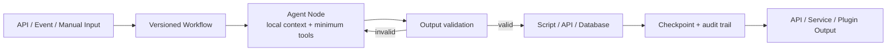

# DeterminFlow

> Deterministic workflows for probabilistic AI.
>
> 让不确定的模型，运行在确定的流程里。

DeterminFlow 是一个面向生产环境的 AI Workflow Runtime（工作流运行时）。它把 LLM、
脚本、API、数据库和人工审批串成可校验、可恢复、可审计的工作流，再快速交付为 API、
后台任务或 Plugin（插件）。

它不让一个 Agent 从头忙到尾。每个节点只做一件事，有自己的上下文、工具权限和失败
处理；Runtime 负责把整条流程稳定跑完。

## 为什么不直接用 Codex、Claude 这类单智能体框架？

Codex、Claude 等单智能体框架很适合探索未知问题。但流程已经明确时，让一个 Agent
反复阅读全部上下文、自己记住每一步，还要负责调用所有工具，通常更慢、更贵，也更难维护。

| 要解决的问题 | Codex、Claude 等单智能体框架 | DeterminFlow |
|---|---|---|
| 改流程 | 修改 Prompt、Skill 和自然语言约束 | 调整版本化节点、变量、分支和子流程 |
| 上下文隔离 | 无法隔离，每轮都带上越来越长的历史 | 每个 Agent Node 只看自己的局部上下文 |
| 结构化输出 | 期待模型一直遵守约定 | 结构化输出、脚本校验、自动修复和定向重试 |
| 失败处理 | 人工判断从哪里重来 | 从失败节点继续，已经完成的部分不用重跑 |
| 控制权限 | 单个 Agent 通常拿到整条流程的工具 | 每个节点只拿自己需要的工具 |
| 成本审计 | 无法审计每个步骤的消耗 | 每个节点、尝试和模型调用单独记账 |
| 对外交付 | 难以包装与交付 | 包装成 API、后台服务、Automation 或 Plugin |

带来的变化很直接：

- **开发更快**：把可靠节点组合起来，验证通过就能接 API 或业务服务。
- **维护更轻松**：流程、参数和输出都有固定结构，不靠一大段 Prompt 维持秩序。
- **运行更稳定**：模型只处理需要判断的部分，控制流和数据流交给 Runtime。
- **失败不重来**：任意节点都能审计、重试和恢复，长流程不必从头再跑。
- **Token 更省**：每个模型只读取自己需要的上下文，不重复背完整历史。
- **权限更小**：工具可以按节点收窄，未来还会加入更强的 LLM 工作区沙箱。

## 看看它长什么样 👀

### 控制台首页

对话、Workflow、Cron、Skills、Rules 和插件都在同一个控制台里。


### 笔枢正文生产 Workflow

导演、世界状态、角色维护、多个专业写手、整合、渲染和落库，都在同一条可恢复流程里。


## 它怎么工作



模型负责思考，Runtime 负责把事情做完：

1. 任务开始时冻结 Workflow、参数和节点输入。
2. Agent Node 在独立会话里运行，只装配这个节点需要的工具。
3. 输出不合格就修复、重试，或者交给人工处理。
4. Script Node 负责文件转换、API 调用和数据库落库等确定性工作。
5. 每次尝试、错误、Token、产物和检查点都会保存，进程重启后也能继续。

## Workflow 背后的完整工具箱

DeterminFlow 不只是一个画流程图的编辑器。Workflow 是主线，其他能力负责准备可复用的
Agent 资产、独立上下文和触发入口，所以复杂流程不用每次都从一大段 Prompt 开始重写。

| 能力 | 在 DeterminFlow 里做什么 |
|---|---|
| 首页对话 | 试跑 Agent、调试 Prompt、查看上下文，也能处理临时任务 |
| Main / Sub 会话 | Main 拆分任务，Sub 在独立上下文里执行，也可以并行工作 |
| Agent 模板 | 复用模型、Prompt、工具权限、Workspace 和最大轮次等运行配置 |
| Prompt 模板 | 把稳定的角色设定和上下文结构做成可复用模板 |
| Skill | 封装领域知识和做事方法，按 Agent 或 Workflow 节点复用 |
| Rule | 把长期约束从 Prompt 中拆出来，集中维护 |
| Cron / API / Event | 定时或由外部系统触发 Workflow 和 Automation |

这些能力不会和 Workflow 抢定位。它们共同解释了为什么 DeterminFlow 能更快地开发、
验证和上线一条复杂流程。

## 已经能做什么

### Workflow 编排

- 可视化 Workflow Editor（工作流编辑器）
- 变量、条件、并行、循环、人工审批和子流程
- Agent、Script、Approval、Subprocess 四类 Core Node
- Agent Node 可以单独选模型；所有节点都能配置输入、输出和失败处理
- 通用 Node 抽象，Fork Core 后可以继续开发新的节点类型

### 可靠执行

- 任务启动时冻结定义和输入，后续修改不会污染正在运行的任务
- 自动重试，也可以人工在原节点重试或跳过
- 进程重启后继续执行，不丢失当前进度
- 并行、循环和子流程都有自己的检查点
- 每次尝试、错误和脚本版本都能追溯

### LLM 运行边界

- 每个 Agent Node 都有独立会话和 Token 账本
- 工具白名单、黑名单、最大轮次和 Workspace 可以按节点配置
- JSON 输出检测、解析、修复和模型重试
- 下游节点可以拒绝结果，让上游定向返工
- 同一条 Workflow 可以混用不同模型

### 观察与交付

- 按 Workflow、Task、Node 和单次模型调用查看用量
- 错误历史、实时状态、WebSocket 事件和健康检查
- FastAPI API、React 管理界面和 Cron Automation
- MCP、Tool、Prompt、Skill 与 Rule 可以一起参与流程
- Core 可以独立运行，不依赖任何业务插件

## 真实案例：笔枢正文生产 ✍️

笔枢的一次正文生产会串起导演、世界状态、角色维护、多个专业写手、整合、校验、渲染
和落库。一次真实完成的任务拆成了 11 个独立模型会话，账本合计 **176,584 Token**。

如果把同一套流程交给 Codex、Claude 这类长链 Agent，让它自己读取资料、调用工具、
维护状态、校验输出并完成落库，粗略成本会变成这样：

| 单智能体场景 | 估算总 Token | 相对现有 Workflow | Workflow 节省 | Terra API 等价成本 | Sol API 等价成本 |
|---|---:|---:|---:|---:|---:|
| 极度优化、几乎没有额外工具循环 | 约 59.5 万 | 3.4× | 约 70% | $0.90 | $2.26 |
| 正常工具调用与上下文增长 | 约 97.0 万 | 5.5× | 约 82% | $1.47 | $3.68 |
| 出现校验修复、重试或长上下文 | 约 161.0 万 | 9.1× | 约 89% | $2.43 | $6.08 |

> 以上基于真实 Workflow Token 账本，以及长链 Agent 重复携带上下文、工具结果和返工的典型开销估算；成本按当时的输入 Token 单价换算。

在这条正文流程上，节点级上下文隔离预计可以减少约 **70%–89%** 的 Token 消耗。

## 把业务打包成 Plugin

Core 只负责通用运行能力，具体业务由 Plugin 带进来。一个 Plugin 可以把下面这些内容
一起交付：

- API 和后台进程
- Workflow Template 与 Script Library（脚本库）
- Agent、Prompt、Skill、Rule 和预设短语
- 配置、数据迁移、健康检查和轻量页面

首个官方案例随 `determinflow-plugins` 一起发布：

| Plugin | 用它展示什么 |
|---|---|
| `bishu-novel` | 小说生产 API、复杂 Workflow、脚本落库和断点恢复 |

Plugin 用现有节点组合 Workflow。需要全新的节点类型时，Fork Core 来加即可。

> ⚠️ Plugin 当前作为本机可信代码运行，没有沙箱隔离。请只安装可信来源；节点级 LLM 沙箱还在 Roadmap。

## 快速开始 🚀

### 只运行 Core

要求 Python 3.11。

```bash
python3.11 -m venv .venv
source .venv/bin/activate
python -m pip install -r requirements.lock
cp .env.example .env
# 在 .env 中填写默认模型的 DEEPSEEK_API_KEY
AI_COMPANY_EXTENSIONS=none python run.py
```

启动后可以访问：

- Web UI：`http://localhost:8020`
- API 文档：`http://localhost:8020/docs`
- Plugin 状态：`GET /api/extensions`

### Docker

```bash
docker compose up --build
```

### 前端开发

```bash
cd web
npm install
npm run dev
```

项目正在从 `AI Company` 迁移到 `DeterminFlow`，所以部分环境变量、Python 包路径和配置
暂时还保留了 `AI_COMPANY_*` 名称。

## 文档

- [架构说明](docs/architecture.md)
- [Plugin Package 规范](docs/plugin-packages.md)
- [Extension 开发指南](docs/extension-development.md)

## 开发与验证

```bash
python -m pip install -r requirements-dev.lock
python -m pytest -q
(cd web && npm run lint && npm run test:extensions && npm run build)
docker compose -f docker-compose.yml config -q
```

## Roadmap

- 逐步完成内部兼容标识的 DeterminFlow 命名迁移
- 为每个 Agent Node 提供更强的 Workspace 与 LLM 执行沙箱
- 完善 Workflow 到独立 API / Service 的发布模板
- 增加更多可复现的官方 Workflow 案例
- 补充英文 README 和版本策略

## 当前状态

`v0.1.0` 是 DeterminFlow 的第一个公开版本。接口仍会快速迭代，欢迎从 Issue 和小型
Workflow 开始参与。

## License

DeterminFlow 使用 [GNU AGPL v3](LICENSE)（`AGPL-3.0-only`）许可证。
